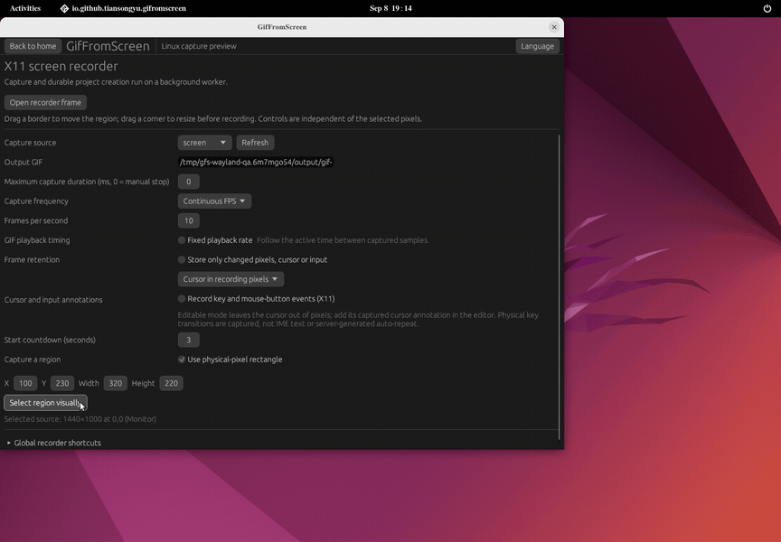
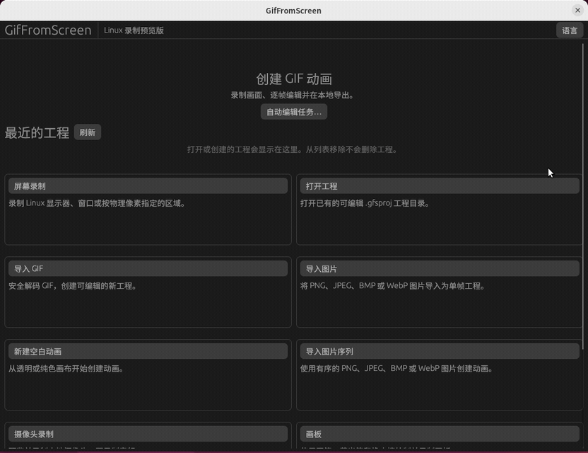

<p align="center">
  
</p>

# GifFromScreen

在 Linux 上录制一块屏幕，逐帧编辑，再导出 GIF。

使用 Rust 编写，录制、编辑和导出均在本地完成。以 ScreenToGif 的工作方式为参考，专注 GIF；当前优先完善 Linux，macOS 尚未提供。

[English](README.en.md) · [Releases](https://github.com/tiansongyu/gifromscreen/releases) · [安装说明](docs/PACKAGING.md) · [反馈问题](https://github.com/tiansongyu/gifromscreen/issues)

## 获取与运行

**[下载 Linux x86_64 预览版](https://github.com/tiansongyu/gifromscreen/releases/download/v0.1.0-preview.3/gifromscreen-0.1.0-linux-x86_64.tar.gz)** · [SHA-256 校验文件](https://github.com/tiansongyu/gifromscreen/releases/download/v0.1.0-preview.3/gifromscreen-0.1.0-linux-x86_64.tar.gz.sha256) · [版本说明](https://github.com/tiansongyu/gifromscreen/releases/tag/v0.1.0-preview.3)

当前版本为 `v0.1.0-preview.3`（约 26.8 MB），可直接下载，不需要登录。它是未签名的开发预览版，不是稳定版。更新的主分支测试包仍可从 [CI Artifacts](https://github.com/tiansongyu/gifromscreen/actions/workflows/portable.yml)获取（需要登录，保留 30 天）。

便携包以 Ubuntu 22.04 / glibc 2.35 为构建基线，包含桌面程序和命令行工具。按照[安装说明](docs/PACKAGING.md#download-and-run)校验下载的 SHA-256 并解压，进入解压后的目录运行：

```sh
sha256sum --check SHA256SUMS
./bin/gif-from-screen
```

无需安装，也无需管理员权限。可选的 `./install.sh` 会添加用户级桌面入口；[卸载说明](docs/PACKAGING.md#installation-and-removal)列出了对应操作。AppImage 仍处于开发验收阶段，Flatpak 尚未交付；请勿把仓库中的打包脚本视为已发布安装包。

## 录制 → 编辑 → GIF



真实 X11 窗口操作，包含暂停后拖动录制框；不是界面模型图。[演示来源与验证](docs/assets/README.md)。

1. **框选并录制。** 打开“屏幕录制”，选择来源和区域。X11 使用独立边框与控制面板；Wayland 先通过系统分享对话框授权，再调整来源内的裁剪区域。开始前可调整尺寸，录制或暂停时可移动固定尺寸区域。
2. **逐帧整理。** 停止后进入编辑器，删除多余帧、调整播放时间、裁剪画面，或添加文字、箭头和点击提示。编辑支持撤销与重做。
3. **导出 GIF。** 选择全部或部分帧，设置颜色、循环、透明与抖动后导出；保留 `.gfsproj` 工程，之后仍可继续编辑。

### 主要功能

- **控制录制：** 倒计时、开始、暂停、继续、停止保存和明确丢弃；连续录制、周期快照、手动快照，以及 X11 桌面交互触发快照。
- **精确定位：** X11 数字坐标、方向键微调、窗口吸附和拖选窗口；录制位置与控制面板分离。GIF 每帧播放时长可独立于采样间隔设置。
- **编辑动画：** 帧选择、排序、剪切/复制/粘贴、延时、降帧、去重、往返循环；裁剪、缩放、旋转、翻转，以及淡入淡出和滑动转场。
- **添加说明：** 字幕、标题帧、水印、形状、自由绘图、边框、阴影和局部动态效果；可编辑的图层、进度、按键、点击与光标标注。
- **复用素材：** 导入 GIF、PNG/JPEG/BMP/WebP、图片序列和视频；新建空白动画、录制画板，以及摄像头录制入口。
- **保留工作：** 录制时增量保存工程，异常后可恢复已写入内容；支持另存工程副本、最近项目和自动编辑/导出预设。

完整功能与限制见 [Linux 状态表](docs/LINUX-STATUS.md)；详细历史和验收入口见[开发记录](docs/DEVELOPMENT-STATUS.md)。

## X11 与 Wayland

| | X11 | Wayland |
| --- | --- | --- |
| 选取区域 | 桌面独立边框、坐标微调、窗口拖选与吸附 | 系统 Portal 选择来源，再在预览中裁剪 |
| 录制中移动 | 移动固定尺寸的桌面区域 | 移动已授权来源内的固定尺寸裁剪 |
| 控制面板 | 与选区分离，优先放在区域外 | 紧凑控制器；录制显示器时需自行移出选区 |
| 全局快捷键 | 可选启用，支持自定义并保存 | 通过 GlobalShortcuts Portal，取决于桌面支持与授权 |
| 输入与光标标注 | 可选采集按键、点击及可编辑光标 | 嵌入/隐藏光标；可使用手工标注 |

快捷键默认关闭；默认组合为 Ctrl+Shift+F7 开框/开始/暂停/继续、Ctrl+Shift+F8 停止、Ctrl+Shift+F9 手动快照。注册失败时仍可用按钮控制。详见[快捷键说明](docs/GLOBAL-SHORTCUTS.md)。

Wayland 不提供通用的全局透明取景框，也不能保证自动排除控制器或强制被遮挡的应用刷新画面。优先选择窗口来源，或确保控制器不在显示器录制区域内。

## 界面语言

默认跟随系统语言，也可在“语言 / Language”中切换并保存选择。目前中英文覆盖首页、录制控制、快捷键设置、编辑器主要帧/计时/变换操作，以及[预览、裁剪和 GIF 导出](docs/PREVIEW-EXPORT-LOCALIZATION.md)。已迁移的提示也能随语言更新；高级工具和部分表单仍在迁移。

主分支已继续补充[效果、形状、绘图、图层管理和工程统计](docs/ADVANCED-EDITOR-LOCALIZATION.md)；这些后续改动尚未包含在 Preview 3 下载中。
主分支也新增了[多图形画布](docs/VECTOR-SHAPE-CANVAS.md)，支持三角形、圆角矩形、块状箭头和直接拖动、缩放、旋转；原生验收和 WPF 像素对照仍在进行中，尚未打包为新 Release。

语言列表中的 29 项是覆盖目标，不代表 29 套完整译文。尚未提供的译文会明确回退到英语，原选择仍会保存；详细范围见[本地化计划](docs/LOCALIZATION-PLAN.md)。



## 运行要求与当前边界

- Linux x86_64、X11 或 Wayland 桌面，以及可用的 OpenGL ES / Vulkan 图形驱动。便携包不是静态链接程序，仍需要[系统运行库](packaging/linux/README.txt)。
- Wayland 屏幕录制需要 PipeWire 和适配桌面的 xdg-desktop-portal 后端，遵循系统分享授权。
- 视频导入额外需要系统 `ffmpeg` 和 `ffprobe`；普通屏幕录制、图片/GIF 编辑和内置 GIF 导出不需要它们。
- 目前仅导出 GIF，不录制音频。摄像头入口已实现，但物理设备验收尚未完成。
- 已有隔离 GNOME/X11 的端到端录制与导出验证；物理 GNOME/KDE、混合 DPI、多显示器、长时间高分辨率录制和部分效果精度仍需继续验收。本项目尚未宣称完整一比一复刻或零缺陷。

按键/点击元数据采集默认关闭。开启后可能记录敏感输入，分享 `.gfsproj` 前请检查工程内容；GIF 不携带工程输入元数据，但已绘制的标注会出现在画面中。

## 从源码运行

需要 Rust 1.88 或更新版本，以及 [CI 列出的 Linux 开发库](.github/workflows/portable.yml)。在仓库根目录运行：

```sh
cargo run --locked -p gif-from-screen
cargo run --locked -p gif-from-screen-cli -- doctor
```

开发检查：

```sh
cargo fmt --all -- --check
cargo clippy --locked --workspace --all-targets --all-features -- -D warnings
cargo test --locked --workspace --all-targets --all-features
```

## 参与和许可

欢迎通过 [Issues](https://github.com/tiansongyu/gifromscreen/issues) 提交复现步骤，注明发行版、X11/Wayland、版本和是否涉及多显示器；提交日志或工程前请移除个人信息。架构与后续工作见[设计文档](docs/DESIGN.md)、[功能对照](docs/FEATURE_MATRIX.md)和[迭代路线](docs/NEXT-LINUX-ITERATION.md)。

本项目采用 [MIT](packaging/licenses/LICENSE-MIT) 或 [Apache-2.0](packaging/licenses/LICENSE-APACHE) 许可。它是独立实现，不使用 ScreenToGif 的品牌素材；部分数值算法按 dotnet/WPF 的 MIT 许可移植，第三方来源与许可见 [NOTICE](packaging/licenses/NOTICE.txt)。
