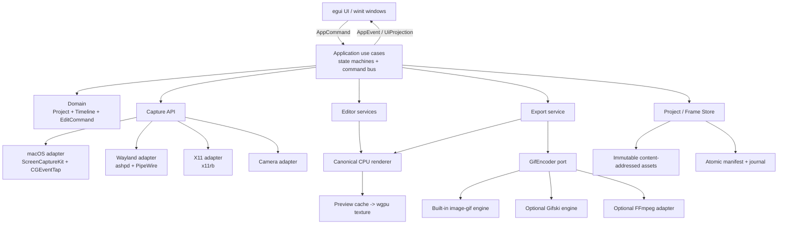

# GifFromScreen 产品与软件架构设计

状态：Draft 0.1  
日期：2026-09-04  
实现语言：Rust  
目标平台：macOS 13+；现代 Linux Wayland 与 X11

## 1. 结论

GifFromScreen 应当是一次 clean-room 的跨平台重新实现，而不是把 ScreenToGif 的 WPF/C# 代码逐文件翻译成 Rust。

建议采用以下主路线：

- UI：`egui + eframe/winit + wgpu`，所有产品逻辑保持为 Rust。
- 架构：领域核心 + 应用状态机 + ports/adapters；UI、OS API 和编码器均为可替换 adapter。
- macOS 捕获：ScreenCaptureKit；键鼠元数据使用 CoreGraphics Event Tap，并明确处理权限。
- Linux Wayland 捕获：XDG ScreenCast Portal + PipeWire；矩形录制采用“先选源、再裁剪”。
- Linux X11 捕获：`x11rb` + MIT-SHM/XDamage/XFixes/XInput。
- 编辑：不可变源帧、非破坏式 effect/overlay track、可序列化 Command、持久化 Undo/Redo。
- 渲染：确定性 CPU 合成是最终真值；GPU 只负责 UI 和预览加速。
- GIF：内置宽松许可编码器为默认；Gifski 和 FFmpeg 位于明确的许可隔离边界。
- 项目：活动目录 + 内容寻址素材 + 原子 snapshot + append-only journal；分享时封装为 `.gfsproj`。

在开始大规模功能开发前，必须先完成 macOS、Wayland、X11、长录制存储和 GIF 质量五类技术验证。

## 2. 产品目标与范围

### 2.1 产品目标

让用户在 Linux 和 macOS 上完成以下闭环：

1. 从屏幕、摄像头、画板、图片、GIF 或视频获得动画帧。
2. 在逐帧时间线上完成与 ScreenToGif 等价的结构、时序、图像、叠加和转场编辑。
3. 保存可恢复、可继续编辑的本地项目。
4. 以可控的颜色、抖动、透明度、循环、差分和质量参数导出 GIF。

### 2.2 “只制作 GIF”与“功能完全一致”的解释

两个要求字面上存在冲突，因为 ScreenToGif 2.43.2 还可以输出 APNG、WebP、视频、PSD 和图片序列。本设计采用以下范围合同：

- 对齐：三种录制器、导入、逐帧编辑、自动任务、项目与恢复、GIF 导出。
- 唯一成品格式：GIF。
- 排除：所有非 GIF 导出、Windows 特有集成、ScreenToGif 品牌与资源。
- 后置能力：GIF 上传、导出后命令和多语言全集不阻塞核心 parity，可在 M4 增加。

完整台账见 [FEATURE_MATRIX.md](FEATURE_MATRIX.md)。任何“已经对齐”的声明都必须落到该表中的可执行验收用例，不能只按菜单名称判断。

### 2.3 非目标

- 不录制、编辑或导出音频。
- 不做通用视频编辑器。
- 不复刻 ScreenToGif 的像素级界面。
- 不默认上传内容或收集遥测。
- 不通过 root daemon、`/dev/input` 或要求用户加入 Linux `input` 组来绕开 Wayland 安全边界。

## 3. ScreenToGif 2.43.2 分析

### 3.1 产品结构

ScreenToGif 从用户视角由四个入口组成：屏幕录制器、摄像头录制器、画板录制器和编辑器。录制结束后生成一个逐帧项目，再进入统一编辑器。

其主要功能组是：

- 创建与插入：三种录制源、空白动画、媒体导入。
- 时间线：多选、播放、剪切复制粘贴、Undo/Redo、删除、去重、降帧、平滑循环、反转、Yoyo、重排和延时修改。
- 图像与叠加：Resize、Crop、Flip/Rotate、Caption、自由文本、标题帧、按键、绘制、形状、鼠标点击、水印、边框、阴影、隐私模糊、Cinemagraph 和进度。
- 转场：Fade、Slide。
- 导出：多种 GIF 编码后端、调色板、量化、抖动、透明、delta frame、循环、范围导出、后台队列和取消。
- 项目运行：缓存、最近项目、恢复、设置、快捷键、自动任务、日志和更新。

官方最新发布是 [2.43.2](https://github.com/NickeManarin/ScreenToGif/releases/tag/2.43.2)。本设计冻结参考 commit 为 [`a4d0a67`](https://github.com/NickeManarin/ScreenToGif/tree/a4d0a67c2131cd048ceec86cd40afc2f1a06f2fd)，避免上游继续变化导致验收口径漂移。

### 3.2 上游实际数据流

当前有效实现可概括为：

```text
Launcher
  -> Recorder / Webcam / Board / Import
  -> ICapture producer
  -> BlockingCollection writer
  -> ProjectInfo + List<FrameInfo> + PNG/Frames.cache
  -> WPF Editor（直接修改帧文件）
  -> ActionStack（复制帧文件做 Undo）
  -> CopyToExport
  -> EncodingManager background task
  -> GIF backend
```

`FrameInfo` 保存帧文件路径、毫秒延时、光标坐标、鼠标按钮、按键序列和录制期像素数据；`ProjectInfo` 同时承担领域模型、临时路径、缓存与持久化职责。

### 3.3 不应照搬的部分

上游已经证明了产品语义，但其内部结构不适合作为跨平台 Rust 架构：

- `Editor.xaml.cs` 约 6,776 行，`Editor.xaml` 约 4,478 行。
- `EncodingManager.cs` 约 2,016 行，`ActionStack.cs` 约 1,033 行。
- 录屏依赖 WPF/WinForms、Win32 hooks、SharpDX Desktop Duplication、GDI 和 DirectShow。
- 编辑器主要是大型 code-behind 和静态 manager。
- Undo 会复制被修改的帧图片，长项目会产生明显磁盘放大。
- 领域模型泄漏 WPF 类型、文件路径和临时目录概念。
- 仓库中的新 Project/Track/Sequence 模型仍是未完成脚手架，实际运行仍使用平面帧列表。

Rust 版本只参考其可观察行为和数据语义，不复制该内部组织。

## 4. 平台可行性边界

### 4.1 macOS

ScreenCaptureKit 能高性能捕获显示器、窗口和应用，并支持 `sourceRect`、光标、BGRA 像素格式和颜色空间配置。区域录制可以直接在显示器流上设置矩形。

需要分别处理：

- Screen Recording 权限：屏幕/窗口内容。
- Camera 权限：摄像头录制。
- Accessibility/Input Monitoring 权限：全局按键与鼠标事件。
- Retina、旋转显示器、多 Space、睡眠/唤醒和屏幕热插拔。

直接分发签名、公证的 DMG 比先进入 Mac App Store 更稳妥。

### 4.2 Linux Wayland

标准流程为 `CreateSession -> SelectSources -> Start -> OpenPipeWireRemote`。Portal 可返回显示器/窗口流和 embedded/metadata cursor，但有三个硬限制：

1. 捕获源选择通常必须由系统对话框确认，应用不能任意枚举所有窗口。
2. 标准源类型没有任意矩形；应先取得整显示器或窗口流，再在应用中裁剪。
3. 没有适合普通录屏的、通用且被动的全局键盘/鼠标点击监听接口。

InputCapture Portal 会接管输入，且由 compositor 决定激活时机，不等价于 ScreenToGif 的后台按键记录。因此 Wayland 上画面录制与编辑可以完整，自动按键/点击标注必须按运行时 capability 降级为手工添加。

### 4.3 Linux X11

X11 可以借助 MIT-SHM、XDamage、XFixes、XInput 和 EWMH 实现接近 ScreenToGif 的区域、窗口、光标和输入元数据行为。无 MIT-SHM 时可回退普通 GetImage，但必须降低 FPS 并提示性能影响。

### 4.4 能力模型

平台能力不能写成简单的 `cfg!(target_os)`。启动和每次授权后都生成运行时能力集：

```rust
CaptureCapabilities {
    monitor,
    window,
    arbitrary_region,
    cursor_embedded,
    cursor_metadata,
    passive_mouse_buttons,
    passive_keyboard,
    global_shortcuts,
    camera,
}
```

UI 必须显示“不可用原因”和授权入口。任何 adapter 都不得返回假成功或静默漏掉元数据。

## 5. 技术栈决策

详细对比见 [ADR-0001-RUST-DESKTOP-STACK.md](ADR-0001-RUST-DESKTOP-STACK.md)。主选型如下：

| 层 | 选择 | 作用 |
|---|---|---|
| UI | egui/eframe | 工具型界面、时间线、属性面板、设置 |
| 窗口与输入 | winit | 多窗口、透明录制覆盖层、DPI/事件循环 |
| GPU | wgpu | UI 与预览纹理；macOS Metal，Linux Vulkan/OpenGL |
| 异步编排 | Tokio | Portal、任务控制、非 CPU 密集 IO |
| CPU 工作池 | Rayon | 缩放、滤镜、缩略图、合成 |
| 通道 | flume 或 crossbeam-channel | 有界背压和 actor 通信 |
| 图像 | image + fast_image_resize | 解码、像素格式、SIMD 缩放 |
| 2D 合成 | tiny-skia | 路径、填充、描边、alpha blend |
| 文本 | cosmic-text + fontdb | 中日韩、RTL、字体 fallback |
| macOS 捕获 | screencapturekit adapter | 显示器/窗口/区域流 |
| Wayland 捕获 | ashpd + pipewire-rs | Portal 授权和 PipeWire 帧 |
| X11 捕获 | x11rb | X11 图像、damage、cursor、input |
| 摄像头 | 自有 CameraBackend；首选 nokhwa | AVFoundation/V4L2 封装 |
| GIF | image-gif + 自研优化层 | 默认宽松许可 encoder |
| 项目序列化 | serde + JSON/NDJSON | manifest、命令 journal、迁移 |
| 哈希/压缩 | BLAKE3 + zstd | 内容寻址和帧块压缩 |
| 打包 | cargo-packager + Flatpak manifest | DMG/AppImage/deb/rpm/Flatpak |

所有依赖版本在 S0 验证后统一锁定；第三方类型不得泄漏到 domain/application 的公开接口。

## 6. 总体架构



核心原则：

- 依赖只朝领域核心方向。
- domain 不知道 egui、winit、文件系统、ScreenCaptureKit、PipeWire 或 GIF crate。
- application 只依赖 ports，不依赖具体平台 adapter。
- unsafe 仅允许在 native adapter 边界，且每处必须有 Safety 注释和封装测试。
- 导出器接收有序 RGBA frame stream，而不是直接读取 UI 状态。

## 7. Cargo Workspace

绿地项目先保持中等粒度，不一开始拆成几十个 crate：

```text
apps/
  desktop/              GUI 程序和 composition root
  cli/                  项目检查、无头导出、回归测试工具

crates/
  domain/               纯领域模型、强类型单位、不变量
  application/          用例、状态机、ports、Command/Event
  project/              manifest、journal、blob store、迁移、恢复
  capture/              CaptureBackend contract、cadence、事件聚合
  capture-macos/        ScreenCaptureKit、CGEventTap、权限
  capture-linux/        Wayland Portal/PipeWire 与 X11 adapter
  media/                图片/GIF/视频导入、颜色与缩略图
  editor/               结构命令、帧分析、去重、转场
  render/               确定性 CPU compositor、preview cache
  gif/                  GifEncoder port、内置与可选 adapter
  ui-egui/              view、view-model 映射和用户 intent
  platform/             hotkey、tray、dialog、notification、update
  test-support/         fake clock/source/store 与 golden fixtures

xtask/                  打包、资源、SBOM、许可和发布检查
```

`capture-macos` 与 `capture-linux` 使用 target-specific dependencies，错误平台不参与编译。portable crates 使用 `#![forbid(unsafe_code)]`。

## 8. 领域模型

### 8.1 强类型单位

必须区分：

- `PhysicalPx`：帧、裁剪和导出使用。
- `LogicalPt`：UI 与操作系统窗口位置使用。
- `ScaleFactor`：二者边界转换。
- `TimeUs`：项目内部统一的单调相对时间。
- `GifTick`：仅在导出最后一步出现，每 tick 为 10ms。

禁止把 UI point、裸 `f32` 坐标或 GIF tick 写入核心帧模型。

### 8.2 项目模型草案

```rust
ProjectManifest {
    schema_version,
    project_id,
    app_version,
    created_at,
    canvas,
    timeline,
    assets,
    export_presets,
    source_provenance,
}

Canvas {
    size_physical_px,
    color_space: Srgb,
    background,
}

Timeline {
    frames: Vec<FrameClip>,
    overlay_tracks: Vec<OverlayTrack>,
    transitions: Vec<Transition>,
}

FrameClip {
    frame_id,
    asset_id,
    duration_us,
    crop,
    transform,
    capture_metadata,
}
```

`Timeline.frames` 的顺序和每帧 `duration_us` 是时序真值，`start_us` 由前缀和计算，避免保存两份可能冲突的数据。Overlay 可用稳定 FrameId 加帧内偏移或绝对项目时间定位。`FrameId`、`AssetId`、`TrackId`、`JobId` 都是 newtype ID，帧序号只是当前视图位置，不能作为持久身份。

### 8.3 Overlay 与 Effect

Overlay track 覆盖：

- Raster、Caption、FreeText、TitleFrame。
- KeyStroke、Cursor、MouseClick、Progress。
- Drawing、Shape、Watermark、Border、Shadow。
- Pixelate、Blur、Darken、Lighten、Cinemagraph mask。

裁剪、缩放、翻转和旋转可以作为 clip transform；去重、删除、插入、反转和 Yoyo 是结构命令；Fade 和 Slide 是 transition。所有编辑默认非破坏，必要时显式执行 Bake 生成新 immutable asset。

### 8.4 Undo/Redo

所有编辑使用可序列化 `EditCommand`：

- `apply(project) -> inverse_command`
- journal 先写命令，再提交新的 revision。
- Undo/Redo 引用 frame/asset ID，不复制整份 RGBA。
- 大型 Bake 操作只保存 before/after blob ID。
- 后台结果必须携带 `ProjectRevision` 与 `JobGeneration`，旧 revision 的结果自动丢弃，避免异步结果覆盖新编辑。

## 9. 项目与帧存储

### 9.1 活动项目目录

```text
<session>/
  manifest.json
  journal.ndjson
  project.lock
  assets/
    <blake3>.frame
  cache/
    thumbnails/
    previews/
```

- `manifest.json`：周期性原子写入 `manifest.tmp -> fsync -> rename`。
- `journal.ndjson`：append-only 命令/WAL，记录 revision 与 checksum。
- `assets`：不可变、内容寻址；重复帧天然去重。
- `cache`：随时可删除，不是项目真值。
- `project.lock`：检测并发打开和异常退出。

保存分享时才把活动目录封装为 `.gfsproj` ZIP。打开项目时解包到 session 目录；恢复时读取最后有效 snapshot 并重放 checksum 正确的 journal 记录。

### 9.2 帧格式

S0 同时基准测试两种方案后确定：

1. 独立 QOI/PNG content-addressed blobs：简单、易诊断。
2. append-only `frames.pack` + zstd block index：长录制吞吐和小文件数量更好。

对外接口统一为 `FrameStore`，因此底层选择不影响编辑器。推荐长期使用分块 pack，并保留“导出诊断帧为 PNG”的 CLI。

### 9.3 内存上限

4K RGBA 单帧约 31.6 MiB。长录制不能把原始帧全部放在内存：

- capture queue 按字节预算限制，默认建议 128–256 MiB，而不是固定帧数。
- PixelBuffer pool 循环使用。
- 只缓存当前帧、邻近帧和可见缩略图。
- UI 时间线必须虚拟化。
- 过载时显式产生 `DroppedFrames` telemetry，并把缺失时间补到下一有效帧；不能静默改变播放速度。

## 10. 录制管线

```text
OS callback / PipeWire thread
  -> CapturedFrame { buffer, pts, damage, cursor, source_epoch }
  -> bounded byte-budget queue
  -> capture aggregator
       - cadence sampling
       - input/cursor timestamp merge
       - crop and color normalization
       - duplicate/change detection
       - dropped-frame duration compensation
  -> single writer actor
  -> immutable frame store + journal
  -> finalize and open editor
```

FrameStore 的规范像素格式为 `RGBA8, straight alpha, sRGB, physical pixels`。合成器工作面使用 premultiplied alpha，并在进入 GIF quantizer 前转回规范 RGBA。平台入口可接收 BGRA、premultiplied alpha、DMA-BUF 或 IOSurface，但必须在 adapter/ingest 边界归一化。首版只处理 SDR，避免 HDR 到 256 色 GIF 的不确定映射。

### 10.1 录制状态机

```text
Idle
 -> Permission
 -> SourceSelection
 -> Armed/Countdown
 -> Recording <-> Paused
 -> Finalizing
 -> EditorReady

任何阶段 -> Cancelled / Failed
```

权限拒绝、Portal 取消、source closed、磁盘满、设备断开和应用退出都是显式事件，不能用散落的 bool 组合推断。

## 11. 编辑与渲染

### 11.1 确定性渲染

导出结果的唯一真值是 CPU renderer：

1. 加载不可变 source frame。
2. 应用 crop/transform/resize。
3. 按 z-order 合成 overlay/effect。
4. 应用 transition。
5. 输出规范化 RGBA8 frame。

wgpu 负责把结果作为纹理显示、缩放和缓存。即使将来增加 GPU 滤镜，也必须保留 CPU golden test 作为语义基线，避免不同 GPU/驱动生成不同 GIF。

### 11.2 Preview

- 缩略图和预览有独立、容量受控的 LRU。
- 拖动参数时使用 generation cancellation，只保留最新任务。
- 播放预览可以在落后时跳过显示，但不能跳过项目帧或修改时长。
- UI update 不允许同步解码、滤镜、写盘或 GIF 编码。

### 11.3 文本

使用 cosmic-text/fontdb 处理字体 fallback、中文、日文、韩文和 RTL。Golden tests 使用仓库内固定许可字体保证跨平台可复现；用户项目使用系统字体时保存字体 family 和 resolved fingerprint，缺失时明确提示替代字体。

## 12. GIF 导出

### 12.1 导出接口

`GifEncoder` 接收：

- 按时间排序的 RGBA frame stream。
- 每帧 `duration_us` 和可选 dirty rect。
- loop、palette strategy、colors、quantizer、dither、transparency、delta、lossy tolerance 和 quality preset。
- cancellation token 与 progress sink。

### 12.2 内置管线

```text
rendered RGBA stream
 -> exact duplicate merge
 -> duration normalization
 -> global/local palette analysis
 -> quantization + dithering
 -> changed rectangle / transparent delta optimization
 -> disposal selection
 -> GIF LZW writer
 -> decode-and-validate
 -> output.partial fsync + atomic rename
```

必须实现：

- 2–256 色，全局与局部调色板。
- Median Cut、Octree、Neural/NeuQuant、灰阶、高频色和自定义 palette 的等价策略。
- 无抖动、Bayer、Floyd–Steinberg、Atkinson、Burkes、Sierra 系列等策略。
- 1-bit 透明、alpha threshold、transparent color/chroma key。
- delta rectangle、clipped frames、重复帧时长合并和 disposal。
- 有限循环与无限循环。
- 导出范围、后台进度、取消、错误与重试。

项目保存微秒时长。导出时采用累计误差分配到 GIF 10ms tick，保证长动画总时长误差不随帧数线性累积。

### 12.3 编码器与许可证

- 默认：MIT/Apache 的 `image-gif` 容器/LZW，加本项目自有 palette、delta 和 timing 层。
- 可选 Gifski：质量高，但官方为 AGPL-3.0-or-later 或商业许可。只有项目采用兼容许可或获得商业授权后才能随正式发行版集成。
- 可选 FFmpeg：主要承担视频导入与兼容性对照。若捆绑，固定 LGPL-only 构建并附完整许可与构建信息；不得依赖未知配置的 GPL binary。

在发行许可证未决定前，核心代码按 permissive 依赖路线设计，Gifski 不进入默认 feature。

### 12.4 导出状态机

```text
Queued -> Preparing -> Rendering -> Encoding -> Validating
       -> AtomicCommit -> Done

任何运行阶段 -> Cancelled / Failed
```

失败或取消后不得覆盖已有目标；`.partial` 文件由明确策略保留或删除。

## 13. UI 信息架构

UI 复用 ScreenToGif 已验证的工作流，但建立自己的视觉系统：

### 13.1 启动页

- Screen Recorder
- Webcam Recorder
- Board Recorder
- Open Project / Import
- Recent Projects

### 13.2 录制覆盖层

- 每个显示器一个无边框透明 viewport。
- 选区尺寸、拖动手柄、放大镜、十字线和三分线。
- 浮动控制条：模式、FPS、倒计时、录制、暂停、停止、丢弃。
- Wayland 先显示 Portal，再基于冻结帧选择区域。

### 13.3 编辑器

```text
+----------------------------------------------------------+
| File | Home | Edit | Image | Transitions | Export        |
+-----------------------------+----------------------------+
|                             | Context inspector          |
|       frame preview         | effect / text / GIF params |
|                             |                            |
+-----------------------------+----------------------------+
| virtualized filmstrip / timeline                         |
+----------------------------------------------------------+
| frame, size, DPI, current time, total duration, jobs      |
+----------------------------------------------------------+
```

顶部功能分组和快捷键语义与上游相近，但不复制 Ribbon 样式。右侧 inspector 只展示当前工具参数；底部胶片支持多选、拖动排序、帧号和延时。

### 13.4 导出面板

- 范围与循环。
- 快速/均衡/高质量预设。
- 高级 palette、quantizer、dither、transparency 和 delta 设置。
- 实时但标注误差的大小估算。
- 后台任务、进度、取消和输出操作。

## 14. 线程与任务边界

| 执行域 | 职责 | 禁止事项 |
|---|---|---|
| UI/main thread | winit/egui、UiProjection、发 Command | 解码、写盘、滤镜、编码、等待锁 |
| macOS capture callback queue | retain/copy frame handle、入队 | 压缩、渲染、IO |
| Linux PipeWire thread | PipeWire main loop、stream callback | 跨线程持有非 Send 对象 |
| capture aggregator actor | cadence、事件合并、裁剪、drop 补偿 | 无界缓存 |
| writer actor | journal、manifest、blob 唯一顺序写入 | 多 writer 并发改项目 |
| Rayon pool | resize、filter、thumbnail、render | Tokio async IO |
| Tokio runtime | Portal、任务编排、非阻塞 IO | CPU 密集循环 |
| export job | 有界 render/encode pipeline | 占满全部 CPU、覆盖现有文件 |

录制优先级高于预览，预览高于后台导出。导出线程数和内存预算必须可配置并有合理默认值。

## 15. 隐私与安全

- 所有内容默认只留在本机，无遥测、无账号、无自动上传。
- 录制键盘必须每次显式开启，并说明可能捕获敏感字符；默认推荐“只显示快捷键/修饰键”。
- 不尝试绕过 macOS secure input。
- Wayland 不使用隐蔽的 evdev 键盘记录方案。
- 所有导入解码器必须有尺寸、帧数、时长和内存上限。
- project/GIF/image parser 纳入 fuzzing。
- 更新清单与安装包签名；每个发行版生成 SBOM、SHA256 和 THIRD_PARTY_NOTICES。
- 外部 FFmpeg/Gifski 进程使用固定参数、无 shell 拼接、受控工作目录和超时/取消。

## 16. 测试策略

### 16.1 领域与编辑

- property tests：插入、删除、重排、反转、Yoyo、延时和 Undo/Redo。
- 不变量：ID 唯一、duration > 0、时间线无非法重叠、Undo 后回到原 revision。
- timing tests：GIF tick 累计误差不超过一个 tick。

### 16.2 项目与恢复

- 每个 schema migration 有固定 fixture。
- save/open roundtrip。
- 在 journal 每个字节边界截断的故障注入。
- 磁盘满、权限失败、进程中止后仍可打开最后 snapshot。

### 16.3 Render 与 GIF

- 固定字体的 golden PNG：alpha、crop、resize、rotate、text、blur、pixelate、shadow、transition。
- GIF 用至少两个独立 decoder 回解码；验证 canvas、帧合成、disposal、透明、loop 和总时长。
- 兼容性人工矩阵：Safari/Preview、Firefox、Chromium、常用 IM/文档平台。
- 质量 corpus：UI、文本、渐变、摄影、透明、高噪声和长静止段。

### 16.4 Capture contract

- fake clock + synthetic frames 测 cadence 和事件聚合。
- Wayland：GNOME、KDE、wlroots；Portal 拒绝/取消、PipeWire disconnect、restore token。
- X11：Xvfb/Xorg、MIT-SHM 存在/缺失。
- macOS：首次授权、拒绝、撤销、Intel/Apple Silicon、Retina、多屏和 sleep/wake。

### 16.5 CI 与发布门禁

- `cargo fmt --check`
- `cargo clippy --all-targets --all-features -- -D warnings`
- `cargo nextest run`
- `cargo doc`、`cargo deny`、`cargo audit`
- 最小 feature 与全 feature 构建
- Linux/macOS 编译矩阵
- 真机 capture smoke tests
- 包安装/卸载、签名、公证、Portal 权限和首次启动测试

## 17. 性能与可靠性目标

S0 基准完成前，下列是验收目标而非已经证明的指标：

- 编辑器时间线可浏览 50,000 帧，UI 不为每帧保留完整 RGBA 或完整 widget。
- 1080p@30 录制 30 分钟、4K@15 录制 10 分钟，不出现无界 RSS 增长。
- 默认 RSS 目标低于 1 GiB；最终值由 S0 基准收紧。
- capture queue 过载可观测，时长保持正确。
- 10 分钟 GIF 总时长误差小于一个 10ms tick。
- 任意导出都可取消，且不遗留冒充成功产物的文件。
- 录制过程中异常退出后，所有已经提交到 writer 的帧都可恢复。

## 18. 实施路线

### S0：风险验证，3–5 周

- macOS：ScreenCaptureKit -> bounded queue -> FrameStore -> GIF。
- GNOME/KDE Wayland：Portal/PipeWire -> 同一 Frame contract。
- X11：MIT-SHM + cursor/input 基线。
- egui 多 viewport 录制框和 5k/50k 帧虚拟时间线。
- 长录制 FrameStore 基准。
- built-in、FFmpeg、Gifski 质量/大小/速度 corpus。

退出条件：三个平台路径至少各有一条真实端到端 vertical slice；权限拒绝、取消和磁盘满不破坏项目。

### M1：可用闭环，8–12 周

- 区域/显示器录制、倒计时、暂停/停止/丢弃。
- 项目保存、journal、恢复。
- 胶片时间线、选择、删除、重排、反转、延时、Undo/Redo。
- Crop/Resize。
- 内置 GIF 的颜色数、循环、时长、重复帧合并、进度和取消。
- macOS DMG、Linux Flatpak/AppImage beta。

### M2：核心编辑器对齐，12–16 周

- Window capture、仅捕获变化、手动/周期快照。
- 去重、降帧、时长缩放、Yoyo。
- 文本、标题、绘制、形状、水印、边框、阴影、隐私效果。
- Fade/Slide、完整 palette/dither/transparency/delta。
- 图片/GIF 导入、剪贴板、预设和统计。

### M3：完整内容来源与高级 parity，10–14 周

- 摄像头、画板和插入录制。
- 视频导入。
- 光标、按键、鼠标事件及平台能力降级。
- Cinemagraph、进度、Smooth Loop、自动任务。
- Gifski 可选后端及许可选择。

### M4：产品化，8–12 周

- i18n、a11y、快捷键、托盘、CLI、更新、诊断。
- 上传/导出后动作是否实现由产品决定。
- 多桌面真机稳定性、签名、公证、SBOM 和发布通道。

完整 parity 的现实规模约为：一名资深 Rust 桌面开发者 12–18 个月，或 3 人团队 6–9 个月。估算会在 S0 后按实际捕获和编码基准重新计算。

## 19. 开始实现前必须决定

1. 产品发行许可证：AGPL、permissive、闭源，或是否购买 Gifski 商业许可。
2. macOS 是否只通过官网下载，还是未来进入 Mac App Store。
3. Linux 是否承诺 Flatpak 为主发行渠道。
4. GIF 上传、导出后 shell command 是否属于最终 parity；默认建议上传可选、shell command 不启用。
5. 是否需要读取 ScreenToGif `.stg` 项目；这会增加格式兼容与许可审查。
6. 最低 Linux 发行版、CPU 架构和 macOS 版本。
7. “Wayland 没有自动按键/点击元数据”的产品文案是否接受。

其中第 1 和第 7 项会直接改变实现与发行方案，S0 结束前必须冻结。

## 20. 参考资料

- [ScreenToGif 2.43.2](https://github.com/NickeManarin/ScreenToGif/releases/tag/2.43.2)
- [ScreenToGif editor commands](https://github.com/NickeManarin/ScreenToGif/blob/a4d0a67c2131cd048ceec86cd40afc2f1a06f2fd/ScreenToGif/Windows/Editor.xaml)
- [ScreenToGif ProjectInfo](https://github.com/NickeManarin/ScreenToGif/blob/a4d0a67c2131cd048ceec86cd40afc2f1a06f2fd/ScreenToGif/Model/ProjectInfo.cs)
- [ScreenToGif FrameInfo](https://github.com/NickeManarin/ScreenToGif/blob/a4d0a67c2131cd048ceec86cd40afc2f1a06f2fd/ScreenToGif/Model/FrameInfo.cs)
- [Apple ScreenCaptureKit](https://developer.apple.com/documentation/screencapturekit)
- [ScreenCaptureKit Rust bindings](https://docs.rs/screencapturekit/latest/screencapturekit/)
- [XDG ScreenCast Portal](https://flatpak.github.io/xdg-desktop-portal/docs/doc-org.freedesktop.portal.ScreenCast.html)
- [XDG GlobalShortcuts Portal](https://flatpak.github.io/xdg-desktop-portal/docs/doc-org.freedesktop.portal.GlobalShortcuts.html)
- [XDG InputCapture Portal](https://flatpak.github.io/xdg-desktop-portal/docs/doc-org.freedesktop.portal.InputCapture.html)
- [pipewire-rs](https://pipewire.pages.freedesktop.org/pipewire-rs/pipewire/index.html)
- [egui](https://github.com/emilk/egui)
- [gifski license](https://github.com/ImageOptim/gifski#license)
